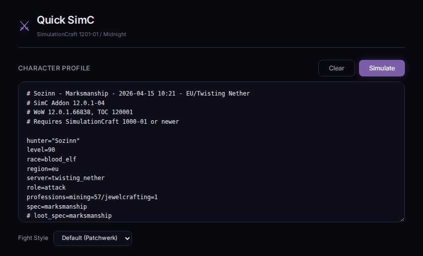
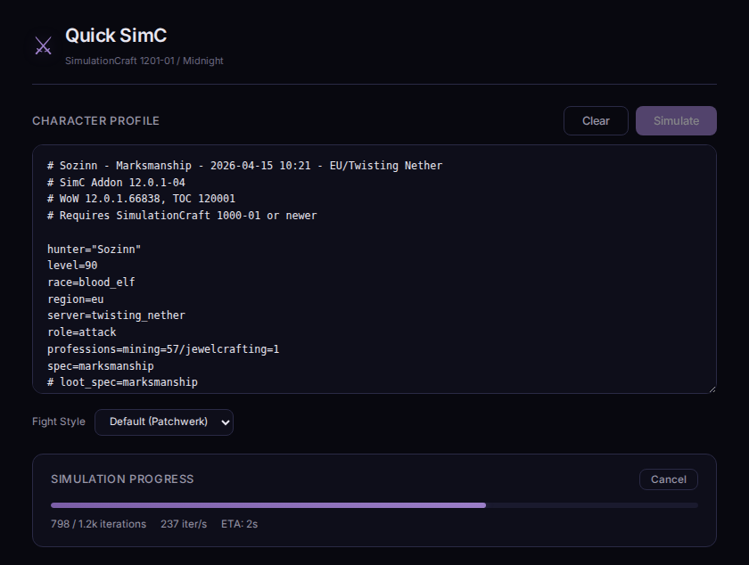
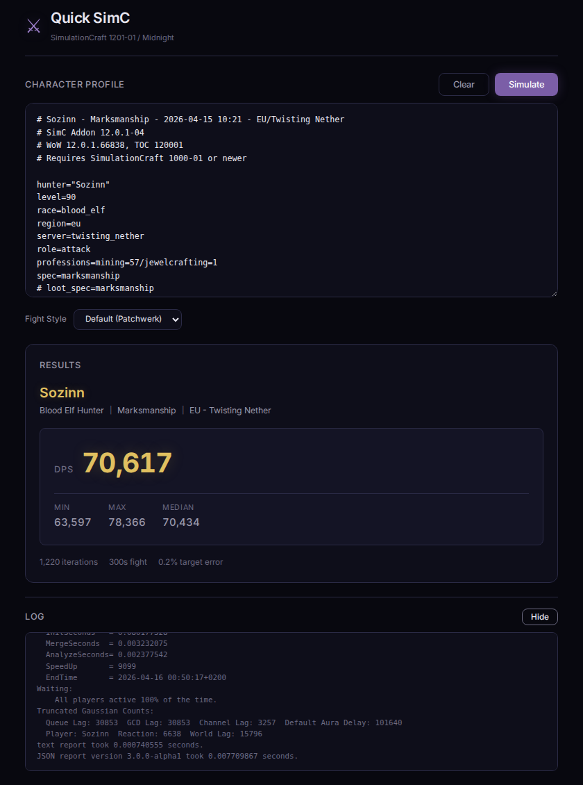

# Quick SimC

> **What is this?**
> A web wrapper around [SimulationCraft](https://github.com/simulationcraft/simc) (midnight branch). Paste your SimC addon export, hit Simulate, get your DPS.

> **Why?**
> No queue, no CLI, no desktop app. Just a browser tab. Paste, click, done.

> **How does it work?**
> SimulationCraft is compiled to WebAssembly with Emscripten (pthreads + SharedArrayBuffer). The whole simulation runs client-side in a Web Worker using all available cores. The Node server does nothing but serve static files, issue cross-origin-isolation headers (required for SharedArrayBuffer), and optionally gate access behind a login. A Service Worker caches the WASM bundle so repeat visits are instant. The WASM file is pre-compressed at build time (brotli + gzip) and served with the matching `Content-Encoding`, so it stays under Cloudflare's 100 MB proxy limit and downloads fast even on slow links. Dangerous config directives (`output=`, `html=`, `json=`, `input=`, `save_*`) are stripped before the config reaches simc.

## Running locally

Requires cmake, g++, make, git, python3 (emsdk deps) and Node 20+:

```bash
./build-wasm.sh
cd src && npm start
```

`build-wasm.sh` installs emsdk into `~/.emsdk` if missing, clones simc, builds it to WebAssembly with `emcmake`, copies the artifacts into `src/public/assets/wasm/`, and runs `npm install`. Set `SIMC_BRANCH` and `WOW_PATCH_NAME` to build a different expansion:

```bash
SIMC_BRANCH=thewarwithin WOW_PATCH_NAME="The War Within" ./build-wasm.sh
```

After the WASM build, `build-wasm.sh` also rewrites the subtitle in `src/public/index.html` (using the simc version from `engine/config.hpp` and the WoW patch version from `engine/dbc/generated/client_data_version.inc`) and the `CACHE_VERSION` constant in `src/public/service-worker.js` (derived from `git describe --tags --always`, override with `APP_VERSION=...`). These two files are mutated **in place** — do not commit their injected values back. Use `NO_INJECT=1 ./build-wasm.sh` to skip the rewrite step.

The first WASM build takes 15-40 minutes. The resulting `simc.wasm` is ~100 MB uncompressed; `build-wasm.sh` also emits `simc.wasm.br` (~7 MB) and `simc.wasm.gz` (~18 MB) which the server picks based on `Accept-Encoding`. Install `brotli` locally (Debian/Ubuntu: `apt install brotli`) before running the build if you want the smaller variant. Everything is cached in the browser on first visit via Service Worker.

## Docker

```bash
docker build -t quick-simc .
docker run -p 3000:3000 quick-simc
```

The image compiles simc to WASM inside an `emscripten/emsdk` build stage and ships only Node + static assets + WASM in the runtime stage (no native simc binary).

## Configuration

All options are environment variables:

| Variable | Default | Description |
|---|---|---|
| `PORT` | `3000` | Web server port |
| `WEB_ACCESS_CODE` | *(empty)* | If set, requires this code to access the app. Redirects to a login page, sets an httpOnly cookie on success. |

Docker build args:

| Arg | Default | Description |
|---|---|---|
| `SIMC_BRANCH` | `midnight` | SimC git branch to clone and build |
| `SIMC_REF` | *(empty)* | Pin to a specific simc commit SHA. Without this, Docker's layer cache misses new upstream commits; CI sets this automatically via `git ls-remote`. |
| `APP_VERSION` | `dev` | Injected into the service worker as `CACHE_VERSION`. CI passes the git tag (or `sha-<short>`) so each release cuts its own cache key. |
| `WOW_PATCH_NAME` | `Midnight` | Display name for the WoW expansion (used in the UI subtitle). Set together with `SIMC_BRANCH`. |

### Examples

```bash
# local with auth
cd src && WEB_ACCESS_CODE=hunter2 npm start

# docker with custom branch and auth
docker build --build-arg SIMC_BRANCH=thewarwithin -t quick-simc .
docker run -p 8080:8080 -e PORT=8080 -e WEB_ACCESS_CODE=hunter2 quick-simc
```

## Browser requirements

- SharedArrayBuffer support (Chrome 68+, Firefox 79+, Safari 15.2+). The server sends COOP/COEP headers to enable `crossOriginIsolated`.
- Enough RAM for the sim (typically 256 MB-1 GB depending on iterations).

## Screenshots



---



---


